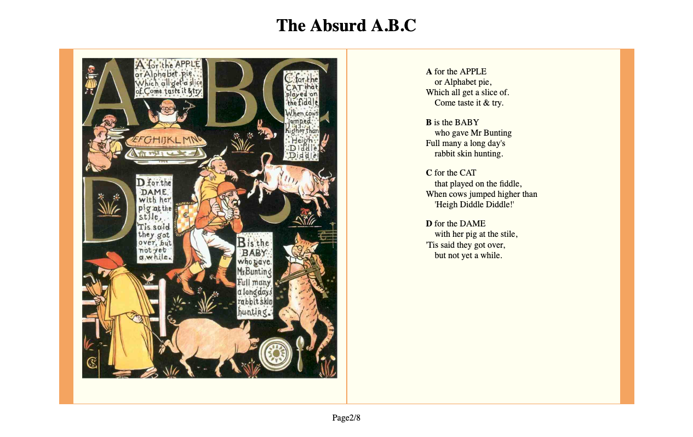
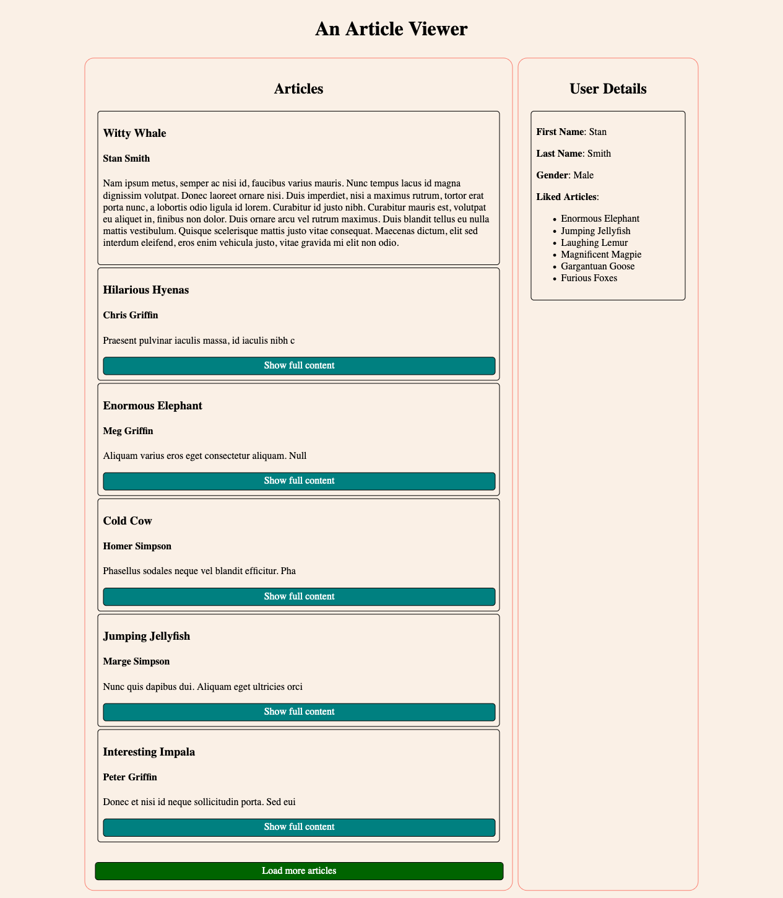

Web Self-Practice Exercise 09 &ndash; Advanced JavaScript & AJAX
==========

Exercise 1 &ndash; Familiarising with AJAX, Fetch and Async Functions with Await
==========

This is a very quick activity. The goal is to observe how a fetch request works and how to access the data. Open the HTML page for Exercise 1 and
have a look at the JSON string received from the server and the HTML elements that are currently generated from the JSON object. Observe how JSON values
are accessed and added to the HTML. 


1. Now also display the id and author_id properties in the HTML by accessing these fields from the JSON object and creating HTML elements to display them. 
Observe how we do not have the full text of the articles of the name of the authors. In activity 3 you will use more AJAX endpoints with these ids 
as parameters to display more complete information.

Exercise 2 &ndash; A Friendly API
==========

The aim of the following exercises is to experiment with AJAX. You will be using a service created expressly for this purpose, which can be found at https://trex-sandwich.com/ajax/. A list of all endpoints and their options can be found at this URL.

In this exercise you will use the simple https://trex-sandwich.com/ajax/story endpoint to create a simple story book. This 
will consist of two visible pages forming a book, with clickable areas on either side of the book that will allow for
 turning to the next or previous pages. The HTML and CSS for this has been provided to you - preview the 
 `ex2/storybook.html` page and look through the source to understand how it is put together. 

You will need to complete the JavaScript code to complete the functionality of the book. This will involve making AJAX calls to the story endpoint. 
The endpoint is very simple.  If it is called directly with no parameters it will provide an array of story page URLs ordered from first to last:

```json
[
    "https://trex-sandwich.com/ajax/story?page=1", 
    "https://trex-sandwich.com/ajax/story?page=2", 
    ...
]
```

If it is called with the `page` parameter set to an integer it will return an object containing a page number, image URL, HTML text content, 
and next/previous page URLs where applicable: 


```json
{
    "next_page":"https://trex-sandwich.com/ajax/story?page=2",
    "image":"https://trex-sandwich.com/ajax/img/cover.jpg",
    "page_number":1,
    "content":"<h2>...</h2>"
}
```

If the story endpoint is queried with an out-of-bounds page number, the first page will be returned. 

When the exercise is complete, your page should look similar to the following image:




1. In the `window.addEventListener("load", function() { ... }` function, use JavaScript to add a click handler to the `turn-left` div. When clicked, the `previous_page()` function should be called. Repeat this process so that when the `turn-right` div is clicked, the `next_page()` function is called. 
Add simple console logging statements to the `previous_page()` and `next_page()` functions so that you can test this functionality - when either div 
is clicked, your message should be printed to the browser developer console.

2. In the initalisePage() function, complete the TODO items. In these TODO steps you will use fetch to perform an AJAX GET request to the 
`https://trex-sandwich.com/ajax/story` endpoint and get a JSON object from the response. Look carefully at the data that is retrieved from 
the `https://trex-sandwich.com/ajax/story` endpoint.
 On a successful call, your code should use the received data to update the `total-page` span with the total number of pages in the book. In the same 
 success function, make a call to the `load_page()` function. This function expects a URL to be provided for it to fetch as a parameter - provide the 
 URL of the first page of the book.

3. In the `loadPage()` function, complete the TODO items. In these TODO items you will perform an AJAX GET request to the URL provided in the 
`page_url` parameter. On a successful call store a copy of the returned object in the `currentPageInfo` variable - this will be 
useful for later tasks. Now call the updatePageDisplay function. 
displayed page. 

4. In the updatePageDisplay function, complete the TODO items. In these TODO items you will update the `current-page` and `total-page` span elements 
to show the number of the current page and total number of pages. Replace the contents of the `page-right` div with the content provided by the received data. Create a new `img` element and set this elements `src` attribute to the image URL provided by the call. Replace the contents of the `page-left` div with 
this new element. 

5. Update the `previous_page(...)` function, replacing your logging statements with code that calls the `load_page()` function with the URL for the 
previous page in the story if one exists (ie, only if the current page is not the first page in the book). Do the same with the `next_page()` 
function this time calling `load_page()` with the URL for the next page of the story if applicable. 

6. Test your story book and ensure that the next and previous page functionality works without errors. Be sure to check the browser 
development console and ensure there are no console logging messages or other errors appearing.


Exercise Three &ndash; A Less-Friendly API
==============

In this exercise you will work with a slightly less friendly set of endpoints with more complex interactions. Begin 
by opening the `ex3/articles.html` file and familiarizing yourself with its content. Currently you will find two grid 
panels titled "Articles" and "User Details". The article panel, when looking at the HTML source, is empty; while the user details panel contains some paragraphs, spans and a list. In the JavaScript file you will find some fully and partially completed JavaScript code - this is where you will be working.

After completing the following steps you should have a page that looks something like this:



In the "Articles" column, you will have a number of panels containing article titles, authors, shortened content and buttons to display the full content of articles. If a "Show full content" button is pressed, the shortened content of the article will be replaced with the full text, and the button will disappear. Clicking the "Load more articles" button will cause more articles to be added to the column. Clicking on the name of an author will update the "User Details" panel with information about the user.

1. Begin by using JavaScript to add a click handler to the `article-load-button` div. When clicked, the 
`displayNextArticlesOnPage()` 
function should be called. Preview your page - clicking the "Load more articles" button should cause new panels to be added to the page. Make sure
you understand how this code works and which other functions it uses. You should also observe which endpoints it is calling and how it is using 
parameters.

2. At the moment, the same two articles should be loaded all of the time. Have a look at the loadArticleCount and loadArticleNext variables
and observe how they are used in the from and count parameters of the getArticleArray function. Think carefully about how you could use these
variables to load new articles each time. You should also make sure that the load articles button can't be clicked when there are no articles left by removing
the event listener. You should change the background colour to red when there are no more articles left. 

3. Complete the getFullArticleObj(), and getLikesArray() functions so that they make requests to the appropriate endpoints and return
JSON objects. You should look at the reference information for different endpoints on https://trex-sandwich.com/ajax/ . These functions will be very similar 
to the getArticleArray() and getUserObj() functions. Think about how you could test these functions with function calls and console messages or the debugger
 to check that they are working as intended. 

4. Now you will complete the displayFullArticleOnPage() function. Look at the contents of the displayPartialArticleOnPage() function, an event listener
was already added to the read-more div that will call the displayFullArticleOnPage() function when clicked. You should complete the TODO items. In these
steps you will use the getFullArticleObj() function and then use the JSON object that is returned from this function to display the full text of an article
in the correct div. You will need to think carefully about how to select the correct div to display the text and you may need to research how to do it; 
remember that the correct div will be a sibling of the div that was clicked.

5. There is also an event listener that calls the displayAuthorDetailsOnPage() function. You should use the getUserObj() function to get the author details
and display them on the page. Make sure to display the first name, last name and gender in the appropriate elements. The final step is to display all of the
articles a user likes. For this you will need to use the getLikesArray() function and loop through all likes to get the title of each liked article. Think
carefully about how you can achieve this.  

6. Look at the example image to see what the finished result should look like.
