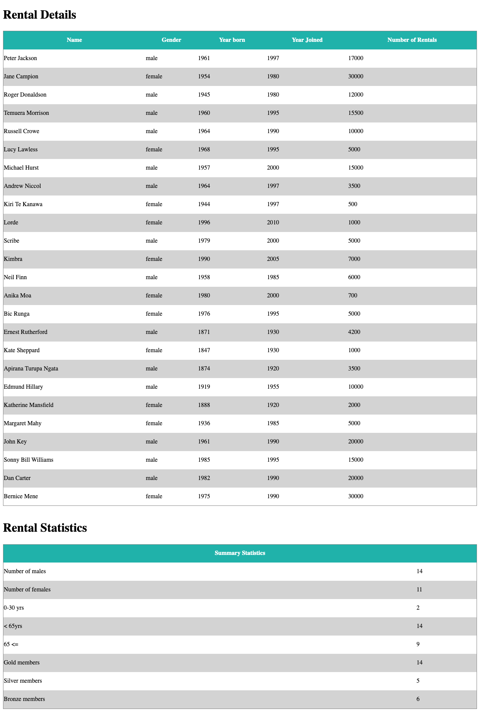

Web Lab 09 &ndash; Advanced JavaScript
==========

Begin by forking this repository into your namespace by clicking the ```fork``` button above, then selecting your username from the resulting window. Once completed, click the ```clone``` button, copy the ```Clone with HTTPS``` value. Open IntelliJ, and from the welcome screen click ```Check out from Version Control -> Git```, then paste the copied URL into the ```URL``` field of the resulting window. Provide your GitLab username and password if prompted.

Explore the files in the project, familiarizing yourself with the content.

When complete, demonstrate your code to your tutor. This must be verified with your tutor by the end of the week.

Exercise 1 &ndash; JSON
==========

 
Inside `video_rental.html` you will find 2 tables, `#details` and `#statistics`. Using JavaScript, you will process the JSON data found in `customerdb.js` to populate these tables. Try to use good programming practices to split the problem into logical chunks and make use of functions. Do not make any changes to the HTML in the file, you must use JavaScript only to generate the output.

In the `#details` table, create and insert a `<thead>` containing the titles:

```json
["Name", "Gender", "Year born", "Year Joined", "Number of Rentals"]
```

In this same table, create a `<tbody>` that contains one row for each entry in the JSON object. When complete, the output should look like that shown in the below screenshot.

In the `#statistics` you will calculate and display some statistics about the customers found in the JSON. You will need to compute:

+ the total number of male customers
+ the total number of females customers
+ the total number of people in the age ranges 0-30, 31-64, and 65+
+ the tally of customers in various "loyalty status" tiers, where: 
  - those who borrowed more than 4 videos a week during the period of their membership are in the "gold" category. 
  - Those who borrowed between 1 and 4 videos per week are in the "silver" category
  - those with less than one video out per week are of the "bronze" category.
  
The age of each user can be calculated using the current year and the year each member was born. Similarly to calculate which loyalty tier each user belongs to, you will need to compute how long they have been a member of the store, and use their total number of rentals to establish an average `movies_per_week` value.

Once these statistics have been calculated, display them as shown in the below screenshot.



Exercise 2 &ndash; A Friendly API
==========

The aim of the following exercises is to experiment with AJAX. You will be using a service created expressly for this purpose, which can be found at https://sporadic.nz/ajax/. A list of all endpoints and their options can be found at this URL.

In this exercise you will use the simple https://sporadic.nz/ajax/story endpoint to create a simple story book. This 
will consist of two visible pages forming a book, with clickable areas on either side of the book that will allow for
 turning to the next or previous pages. The HTML and CSS for this has been provided to you - preview the 
 `ex2/storybook.html` page and look through the source to understand how it is put together. 

You will need to complete the JavaScript code to complete the functionality of the book. This will involve making AJAX calls to the story endpoint. The endpoint is very simple.  If it is called directly with no parameters it will provide an array of story page URLs ordered from first to last:

```json
[
    "https://sporadic.nz/ajax/story?page=1", 
    "https://sporadic.nz/ajax/story?page=2", 
    ...
]
```

If it is called with the `page` parameter set to an integer it will return an object containing a page number, image URL, HTML text content, and next/previous page URLs where applicable: 


```json
{
    "next_page":"https://sporadic.nz/ajax/story?page=2",
    "image":"https://sporadic.nz/ajax/img/cover.jpg",
    "page_number":1,
    "content":"<h2>...</h2>"
}
```

If the story endpoint is queried with an out-of-bounds page number, the first page will be returned. 

When the exercise is complete, your page should look similar to the following image:


1. In the `window.addEventListener("load", function() { ... }` function, use JavaScript to add a click handler to the `turn-left` div. When clicked, the `previous_page()` function should be called. Repeat this process so that when the `turn-right` div is clicked, the `next_page()` function is called. Add simple console logging statements to the `previous_page()` and `next_page()` functions so that you can test this functionality - when either div is clicked, your message should be printed to the browser developer console.

2. Again in the `window.addEventListener("load", function() { ... }` function, perform an AJAX GET request to the https://sporadic.nz/ajax/story endpoint. On a successful call, your code should use the received data to update the `total-page` span with the total number of pages in the book. In the same success function, make a call to the `load_page()` function. This function expects a URL to be provided for it to fetch as a parameter - provide the URL of the first page of the book.

3. In the `page_load()` function, perform an AJAX GET request to the URL provided in the `page_url` parameter. On a 
successful call store a copy of the returned object in the `current_page_info` variable - this will be useful for task 4. Using information from the returned object, update the `current-page` span to reflect the page number of the currently displayed page. Replace the contents of the `page-right` div with the content provided by the received data. Create a new `img` element and set this elements `src` attribute to the image URL provided by the call. Replace the contents of the `page-left` div with this new element.

4. Update the `previous_page()` function, replacing your logging statements with code that calls the `load_page()` function with the URL for the previous page in the story if one exists (ie, only if the current page is not the first page in the book). Do the same with the `next_page()` function this time calling `load_page()` with the URL for the next page of the story if applicable. 

5. Test your story book and ensure that the next and previous page functionality works without errors. Be sure to check the browser development console and ensure there are no console logging messages or other errors appearing.


Exercise Three &ndash; A Less-Friendly API
==============

In this exercise you will work with a slightly less friendly set of endpoints with more complex interactions. Begin 
by opening the `ex3/articles.html` file and familiarizing yourself with its content. Currently you will find two grid 
panels titled "Articles" and "User Details". The article panel, when looking at the HTML source, is empty; while the user details panel contains some paragraphs, spans and a list. You will also find some fully and partially completed JavaScript code - this is where you will be working.

After completing the following steps you should have a page that looks something like this:


In the "Articles" column, you will have a number of panels containing article titles, authors, shortened content and buttons to display the full content of articles. If a "Show full content" button is pressed, the shortened content of the article will be replaced with the full text, and the button will disappear. Clicking the "Load more articles" button will cause more articles to be added to the column. Clicking on the name of an author will update the "User Details" panel with information about the user.

1. Begin by using JavaScript to add a click handler to the `article-load-button` div. When clicked, the 
`load_more_articles()` 
function should be called. Preview your page - clicking the "Load more articles" button should cause new panels to be added to the page.

2. Modify the `load_more_articles()` function so that the `article-load-button` cannot be pressed while articles are being loaded. The easiest way to accomplish this is to remove the click handler when the function begins, and re-add it again on success.

3. In its current state, the `load_more_articles()` function repeatedly loads the same articles. This is due to the 
`from` parameter for the AJAX call being hardcoded to `0`. Make changes to the code to allow for this value to be 
changed so that subsequent AJAX calls fetch different data. *HINT*: You will want to introduce a variable here, remember to update it on success.

4. Test your article loading code by loading the page and repeatedly clicking the `article-load-button` div. Ensure that each article is only displayed once. Update your `load_more_articles()` function so that when there are no more articles that can be loaded, the `article-load-button` div turns red, and the click behaviour is disabled.

5. Your page should be loading article panels now, but you will notice that your page does not match what is shown above
. The panels are generated in the `insert_article_into_page()` function - take a look in there now. You will notice 
that there are a number of blank spots marked with TODO comments - these need to be completed to get the panels 
looking right. Complete each of the TODO tasks, namely:
  - Create a new `h4` element that will represent the author line in the panels. Add the class `article-author` to this element and set its text to the `author_id` value found in the `article` parameter. Add an attribute to the element named `author_id` and set its value to the `author_id` value found in the `article` parameter - This will be needed later.
  - Add the required code to make the `article_read_more` div display the "Show full content" text. Additionally add an attribute to the element named `article_id` and set its value to the `id` value found in the `article` parameter.
  - Ensure that your newly created `h4` and modified `div` is added to the `article_div` element in the correct order.

6. At this stage the article panels should be looking a bit better, but the author is still not displaying correctly - it shows a number instead of a name. You need to make a call to the users endpoint to retrieve the name of the user associated with that id. At the end of your `insert_article_into_page()` function perform an AJAX GET request to the users endpoint - supplying the appropriate parameter - and using the returned information replace the user id number with the first and last names of the user.

7. The next step in the process is to complete the functionality for when the `article-read-more` divs are clicked. The click handler for these has already been wired up for you and is ready for you to complete. In the `load_full_article()` function you will notice that there are a number of blank spots marked with TODO comments - as with part 5 you will need to complete each of those tasks, namely:

  - Retrieve the `article_id` attribute from the clicked div and store this in a variable. *HINT*: `sender.target` will 
return an 
object representing the element that has been interacted with.

  - Identify the element containing the short version of the article that you will be replacing and store a reference to 
this element in a variable. It is important to do this here, you will have a lot of trouble if you try to do this 
elsewhere. *HINT*: You are looking for a sibling element to the clicked div.

  - Disable the click behaviour of the `article-read-more` div that was clicked, then remove it from the page.
Perform an AJAX GET request to the articles endpoint - supplying the appropriate parameter with the value retrieved from the `article_id` attribute - and retrieve the full article content from the returned data. Replace the shortened article text with the full content of the article.

8. The final and most finicky step takes place in the `load_author_details()` function - the function called when an author name is clicked. When this is clicked there are a number of things that need to happen to update the "User Details" panel including 3 separate AJAX calls - one which is nested within another


  - Retrieve the stored `author_id` value from the clicked author name and store this in a variable.

  - Perform an AJAX GET request to the users endpoint - supplying the appropriate parameter - and using the returned information update the First Name, Last Name and Gender values in the "User Details" panel. There are spans that can be targeted to store this information - remember to translate the retrieved gender codes to the text "Male" or "Female".

  - Empty the `user-details-liked-articles` list and then perform an AJAX GET request to the likes endpoint - supplying the appropriate parameter to get an array of article ids liked by the user. These ids aren't much use on their own - we want article titles! - so you will need to perform another AJAX GET request inside the success method of the other, this time to the articles endpoint. Provide each of the liked article ids to this inner request in turn and use the retrieved data to obtain the title of the liked article. Create a new `li` element for each liked article, set the text of this element to the title of the article, and add it to the `user-details-liked-articles` list.
